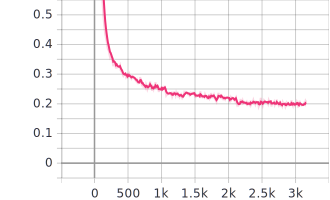

# Shopee Code League 2021 (Data Science) - Address Elements Extraction

Steps
- Explore dataset with Jupyter notebook. Some sample code to prepare the dataset
- Write a script to prepare the dataset, split train and validation set
- Try training a subset of train set with Jupyter notebook
- Write a script to train the model on full train set
- Inference section in a Jupyter notebook

## Set up environment

Assume CUDA 10.2 is installed on the system

```
conda install -f environment.yml
conda activate ner
```

## Download dataset

From the Kaggle page: Shopee Code League 2021 - Address Elements Extraction

https://www.kaggle.com/c/scl-2021-ds/data

Extract `train.csv` and `test.csv` to this directory

## Problem formulation

See the original problem statement in the above Kaggle page.

I attempted this problem as a Named-Entity Recognition (NER) problem. Treating POI and street and entities, I will train a model to extract those entities from the raw address.

## Prepare dataset

See the notebook [process_data.ipynb](process_data.ipynb)

Outline of the steps
- Split `POI/street` into separate `POI` and `street` columns
- Use Moses tokenizer (from `sacremoses`) to tokenize `raw_address`, `POI` and `street`
- Label the tokens in `raw_address` by matching `POI` and `street` tokens with those in the `raw_address`
    - `raw_address` may contain incomplete `POI` and `street`, thus perfect match is not guaranteed. Around 15% of the labels have this problem
    - I use fuzzy match (from `fuzzywuzzy`) to do partial match
    - Standard way to label NER task is with start token `B-entity` and next tokens `I-entity`. However, because each raw address is supposed to have only 1 unique entity type (POI and street), it becomes more messy when I try to post-process the model outputs (combine neibouring tokens). Thus I just use 1 label for each entity type, and don't differentiate between the first token and next few tokens for an entity.
- Split the original train set into train and validation set (validation is 10%)
- Export to json to preserve the list structure of tokens

The actual script to prepare data is `process_data.py`

## Model training

See the notebook [train_model.ipynb](train_model.ipynb). I followed Hugging Face notebook tutorials to fine-tune transformer-based models.

Models I have tried
- `DistilBert`: from the Hugging Face tutorial. Performance is worst because it was trained on English dataset
- `XLM-Roberta`: best performance because it is a multilingual model
- `indobert`: comparable performance with XLM-Roberta

Outline of the steps
- Import the processed data and load the pre-trained model's tokenizer
- Use the tokenizer to tokenize the imported data
    - Most, if not all, transformer models use sub-word tokenization (like WordPiece). Thus their tokenizers will further break down the word tokens into sub-word tokens
- Re-align the labels with sub-word tokens
- Prepare `torch` dataset
- Train the model the Hugging Face's `Trainer`

Trainer is a convenient way to do training because it automatically sets up:
- Model checkpoint
- Logging to TensorBoard
- Multi-GPU training

The actual training script is `train_model.py`. By changing the pre-trained model name and training hyper-parameters, I can easily train many different models. The training progress can be observed in TensorBoard

Training curve for XLM-Roberta



## Model inference

See the notebook [inference.ipynb](inference.ipynb). I used Hugging Face's `pipeline` so that it handles some post-processing work (group neighbouring tokens with the same predicted label)

Outline of the steps
- Load test set and import `id2tag` to decode model output
- Use `pipeline` to load the trained model
- Perform inference on the test set
- Select the POI and street with the highest score
- Output to required format `POI/street`